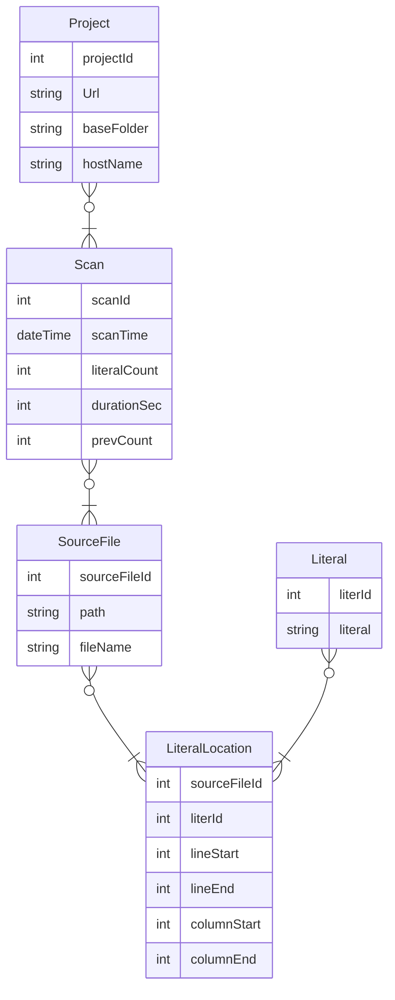

# LiteralCollector

C# Roslyn command line app that gets all the literals and constants from a source tree and puts them in a database

Originally a VisualStudio 2015 .NET Framwork console application, this is now a .NET 7 console app. It gets all the cs SourceFiles in a folder and uses Rosyln to parse them and extracts out all the string and numeric literals and constants putting them in a database.

It was written to aid in refactoring code that had a huge number of magic strings and numbers.

## Data Model

